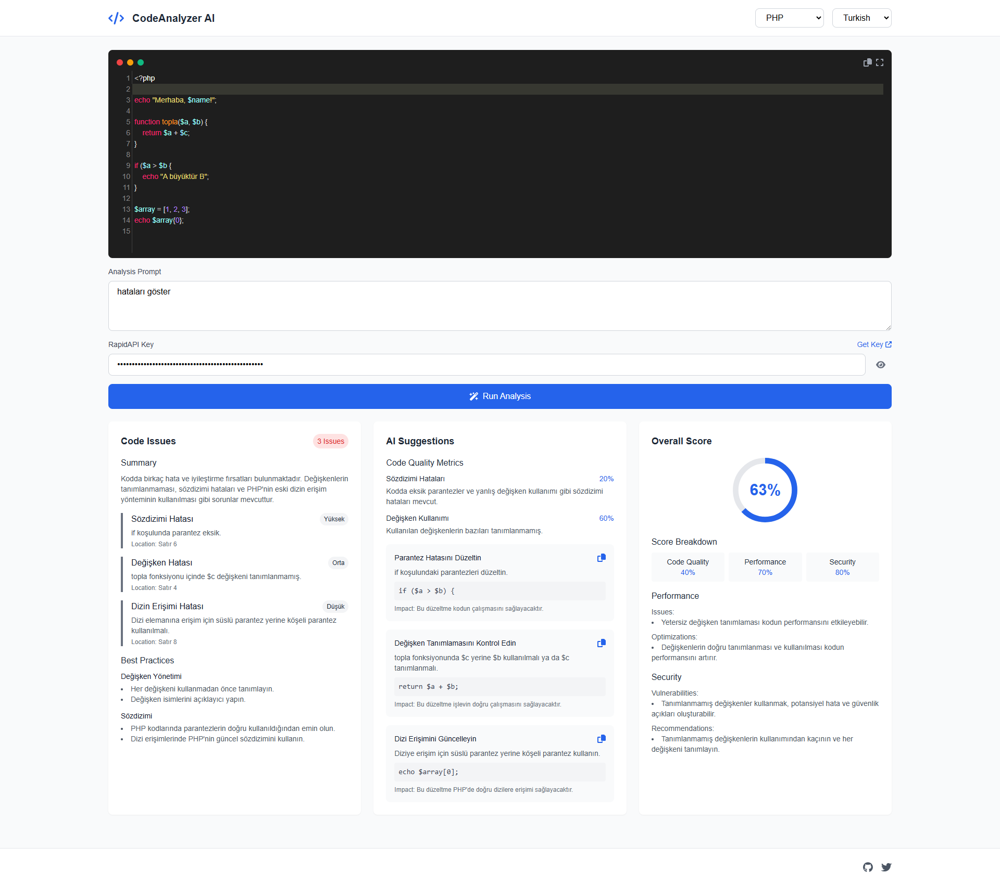

# AI Code Reviewer

AI Code Reviewer is a powerful web-based code analysis tool that helps developers improve their code quality through AI-powered suggestions, performance analysis, and security recommendations.

## Features

- **Multi-Language Support**
  - JavaScript/TypeScript
  - React/JSX
  - PHP
  - Python
  - Java
  - C++/C#
  - Ruby
  - Go
  - Rust
  - HTML/CSS
  - SQL

- **Real-Time Analysis**
  - Code quality metrics
  - Performance optimization
  - Security vulnerability detection
  - Best practices recommendations

- **Interactive UI**
  - Modern code editor with syntax highlighting
  - Responsive design for all devices
  - Dark mode support
  - Fullscreen editing capability

## Key Components

### Code Editor
- Syntax highlighting for multiple languages
- Line numbers
- Auto-closing brackets
- Code folding
- Fullscreen mode

### Analysis Features
1. **Code Issues**
   - Severity-based issue categorization
   - Detailed issue descriptions
   - Location references
   - Best practices recommendations

2. **AI Suggestions**
   - Code quality metrics
   - Improvement suggestions
   - Code examples
   - Impact analysis

3. **Overall Score**
   - Combined quality score
   - Breakdown by category
   - Performance metrics
   - Security assessment

## Getting Started

1. Visit the application URL
2. Select your programming language
3. Choose your preferred response language
4. Get your RapidAPI key from [here](https://rapidapi.com/bilgisamapi-api2/api/generative-ai-api-openai-gpt-4o-api-ai-integration)
5. Enter your code in the editor
6. Click "Run Analysis" to get detailed feedback

## Technical Details

### Built With
- HTML5
- TailwindCSS
- JavaScript
- CodeMirror Editor
- RapidAPI Integration

### State Management
- URL-based state persistence
- Local storage for API key
- Real-time state updates

### Responsive Design
- Mobile-first approach
- Tablet and desktop optimized
- Flexible layout system